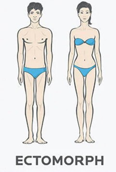
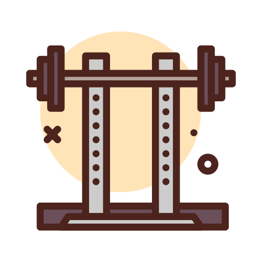
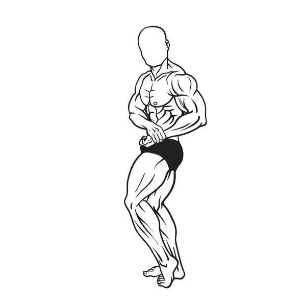
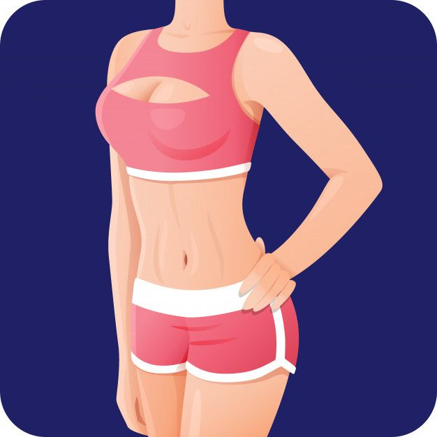
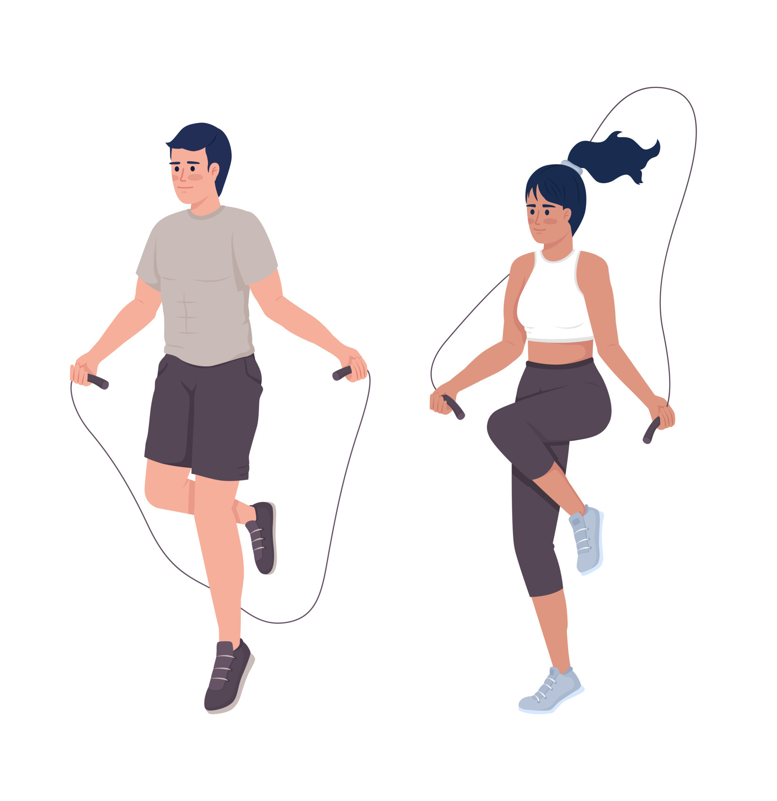
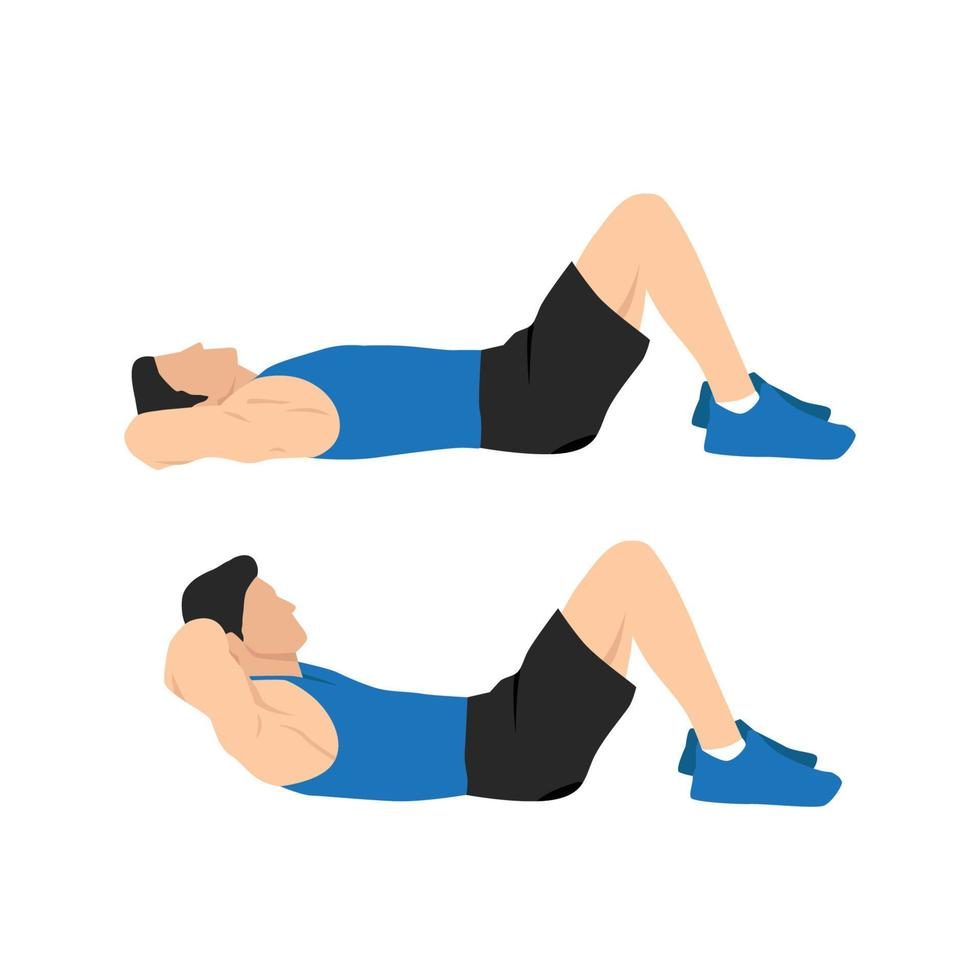
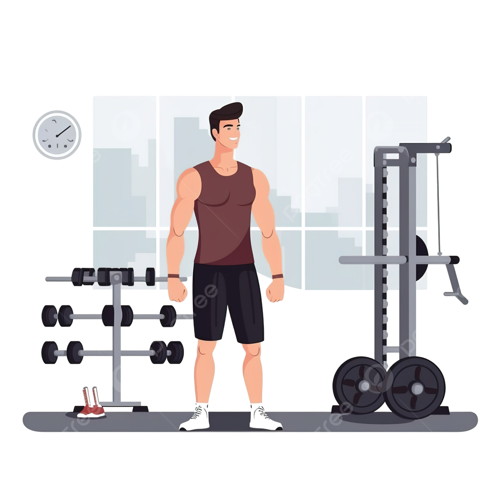
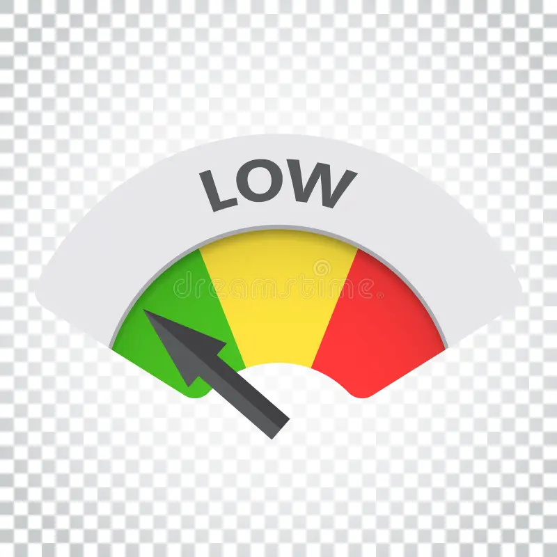
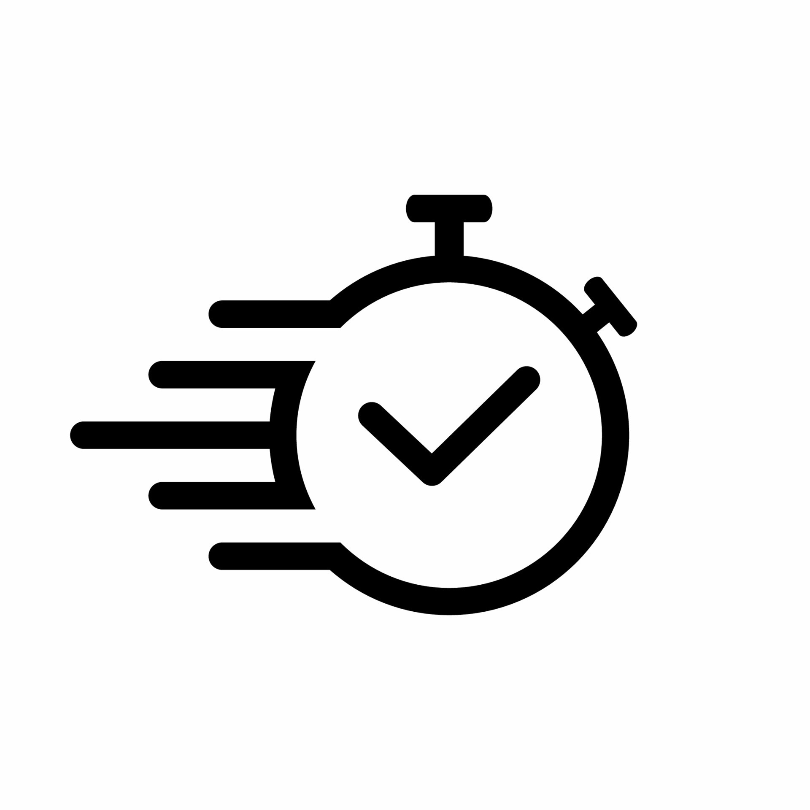
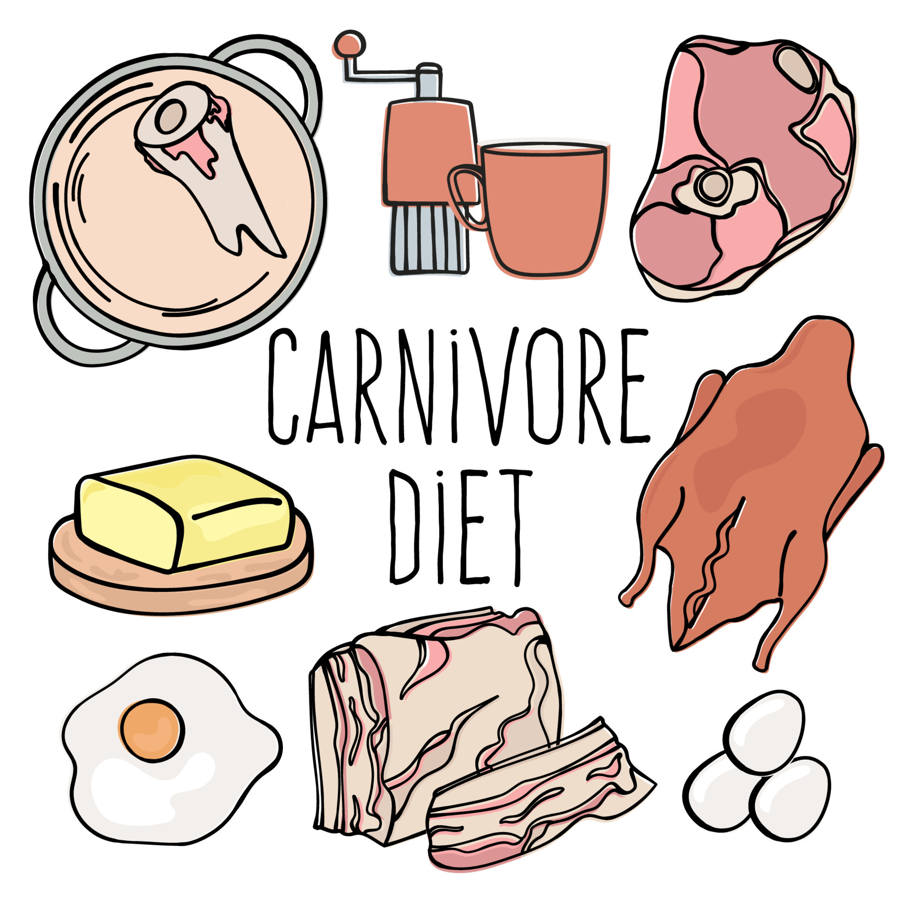

    

  <h3 align="center">🏋️‍♂️ Assistente de Personal Trainer - Gerador de Treino Ideal</h3>
Este projeto é um desafio de Prompt Engineer, onde o objetivo é criar um prompt que ajuda a montar o treino ideal para cada combinação de fatores, como biotipo corporal, disponibilidade de tempo e tipo de exercícios preferidos. O assistente de personal trainer gerado por esse prompt será capaz de personalizar os treinos de acordo com as características e necessidades do usuário.
O projeto deve ser feito utilizando as boas práticas de prompt engineer.

## 📋 Índice

- [📋 Índice](#-índice)
- [📝 Introdução](#-introdução)
- [💪 Biotipos Corporais](#-biotipos-corporais)
- [📅 Dias Disponíveis para Treino](#-dias-disponíveis-para-treino)
- [🏋️ Tipos de Exercícios](#️-tipos-de-exercícios)
- [🛠️ Regras de negócio](#️-regras-de-negócio)
- [📖 Material de Apoio](#-material-de-apoio)
- [🎯 Prompt de Resposta Proposto](#-prompt-de-resposta-proposto)

---

## 📝 Introdução

O modelo gera treinos personalizados com base nas informações fornecidas pelo usuário, utilizando variáveis como biotipo corporal, quantidade de dias disponíveis para treino, tipo de exercício preferido, objetivo, nível de experiência, preferências por equipamentos, ajuste de volume e intensidade, tempo de duração do treino e alimentação.

---

## 💪 Biotipos Corporais

A primeira regra para personalizar o treino é determinar o biotipo corporal do usuário. Existem três biotipos principais:

<table>
  <tr>
    <th>Imagem</th>
    <th>Biotipo</th>
    <th>Descrição</th>
  </tr>
  <tr>
    <td style="text-align: center;">
      
    </td>
    <td><strong>Ectomorfo</strong></td>
    <td>Corpo mais magro, difícil ganhar peso e massa muscular.</td>
  </tr>
  <tr>
    <td style="text-align: center;">
      
    </td>
    <td><strong>Mesomorfo</strong></td>
    <td>Corpo naturalmente musculoso, facilidade para ganhar massa muscular e perder gordura.</td>
  </tr>
  <tr>
    <td style="text-align: center;">
      
    </td>
    <td><strong>Endomorfo</strong></td>
    <td>Corpo com tendência a acumular gordura, maior dificuldade em perder peso.</td>
  </tr>
</table>

> **Nota:** Escolha o biotipo que mais se aproxima do seu corpo atual para que o treino seja mais eficiente.

---

## 📅 Dias Disponíveis para Treino

A segunda regra é determinar quantos dias por semana o usuário tem disponível para treinar. Dependendo do número de dias, o treino sugerido pode variar:

| **Imagem**                                                     | **Dias por Semana** | **Tipo de Treino Sugerido** |
| -------------------------------------------------------------- | ------------------- | --------------------------- |
|  | 1 dia               | Treino Full Body            |
|  | 3 dias              | Treino ABC                  |
|  | 5 dias              | Treino ABCDE                |

- **Full Body**: Treino que trabalha o corpo todo em uma única sessão.
- **ABC**: Divisão do treino em três dias, cada um focado em grupos musculares diferentes.
- **ABCDE**: Divisão do treino em cinco dias, com foco ainda mais específico em cada grupo muscular.

---

## 🏋️ Tipos de Exercícios

A terceira regra envolve a escolha do tipo de exercício preferido. Aqui estão algumas categorias com exemplos:

| **Imagem**                                                       | **Tipo de Treino** | **Descrição**                                                                                                 |
| ---------------------------------------------------------------- | ------------------ | ------------------------------------------------------------------------------------------------------------- |
|  | **Funcional**      | Exercícios que melhoram a funcionalidade do corpo, usando movimentos naturais.                                |
|   | **Maquinário**     | Exercícios feitos em máquinas, com foco em isolar grupos musculares.                                          |
|      | **Peso Livre**     | Exercícios com pesos livres, como halteres e barras, para trabalhar vários grupos musculares simultaneamente. |
|    | **Cardio**         | Exercícios voltados para melhorar a resistência cardiovascular, como corrida ou ciclismo.                     |
|      | **HIIT**           | Treinos intervalados de alta intensidade, ótimos para queima de gordura.                                      |

---

## 🎯 Objetivo

O objetivo determina a estrutura e intensidade do treino. Exemplos:

<table>
  <tr>
    <th>Imagem</th>
    <th>Objetivo</th>
    <th style="width: 60%;">Descrição</th>
  </tr>
  <tr>
    <td style="text-align: left;">
      
    </td>
    <td><strong>Hipertrofia</strong></td>
    <td>Foco no ganho de massa muscular.</td>
  </tr>
  <tr>
    <td style="text-align: left;">
      
    </td>
    <td><strong>Definição</strong></td>
    <td>Queima de gordura e tonificação muscular.</td>
  </tr>
  <tr>
    <td style="text-align: left;">
      
    </td>
    <td><strong>Resistência</strong></td>
    <td>Aumento da capacidade cardiovascular e muscular.</td>
  </tr>
</table>

---

## 📈 Nível de experiência

O treino varia de acordo com a experiência:

<table>
  <tr>
    <th>Imagem</th>
    <th>Objetivo</th>
    <th style="width: 60%;">Descrição</th>
  </tr>
  <tr>
    <td style="text-align: left;">
      
    </td>
    <td><strong>Iniciante</strong></td>
    <td>Exercícios mais simples, maior foco na forma.</td>
  </tr>
  <tr>
    <td style="text-align: left;">
      
    </td>
    <td><strong>Intermediário</strong></td>
    <td>Introdução a treinos mais complexos e maior intensidade.</td>
  </tr>
  <tr>
    <td style="text-align: left;">
      
    </td>
    <td><strong>Avançado</strong></td>
    <td>Treinos mais desafiadores, com maior volume e intensidade.</td>
  </tr>
</table>

---

## 🏠 Preferências por Equipamentos

Escolha de onde o treino será realizado:

<table>
  <tr>
    <th>Imagem</th>
    <th>Tipo de Treino</th>
    <th style="width: 60%;">Descrição</th>
  </tr>
  <tr>
    <td style="text-align: left;">
      
    </td>
    <td><strong>Treino em Casa</strong></td>
    <td>Uso de peso corporal, halteres, bandas de resistência.</td>
  </tr>
  <tr>
    <td style="text-align: left;">
      
    </td>
    <td><strong>Academia</strong></td>
    <td>Acesso a máquinas e equipamentos diversos.</td>
  </tr>
</table>

---

## 🔄 Ajuste de Volume e Intensidade

O volume e intensidade são ajustados com base na capacidade e objetivo do usuário:

<table>
  <tr>
    <th>Imagem</th>
    <th>Volume e Intensidade</th>
    <th style="width: 60%;">Descrição</th>
  </tr>
  <tr>
    <td style="text-align: left;">
      
    </td>
    <td><strong>Baixo</strong></td>
    <td>Treino leve, focado em condicionamento.</td>
  </tr>
  <tr>
    <td style="text-align: left;">
      
    </td>
    <td><strong>Moderado</strong></td>
    <td>Para hipertrofia ou definição com desafios equilibrados.</td>
  </tr>
  <tr>
    <td style="text-align: left;">
      
    </td>
    <td><strong>Alto</strong></td>
    <td>Para atletas avançados ou objetivos específicos de desempenho.</td>
  </tr>
</table>

---

## ⏱️ Tempo de Duração do Treino

<table>
  <tr>
    <th>Imagem</th>
    <th>Tempo de Duração</th>
    <th style="width: 60%;">Descrição</th>
  </tr>
  <tr>
    <td style="text-align: left;">
      
    </td>
    <td><strong>Treino Rápido</strong></td>
    <td>30-40 minutos.</td>
  </tr>
  <tr>
    <td style="text-align: left;">
      
    </td>
    <td><strong>Treino Moderado</strong></td>
    <td>45-60 minutos.</td>
  </tr>
  <tr>
    <td style="text-align: left;">
      
    </td>
    <td><strong>Treino Extenso</strong></td>
    <td>60-90 minutos.</td>
  </tr>
</table>

---

## 🍽️ Alimentação

O plano alimentar é personalizado de acordo com as preferências alimentares do usuário:

<table>
    <tr>
        <th>Imagem</th>
        <th>Tipo de Alimentação</th>
        <th style="width: 60%;">Descrição</th>
    </tr>
    <tr>
        <td style="text-align: left;">  </td>
        <td><strong>Vegetariana</strong></td>
        <td>Baseada em proteínas vegetais (lentilhas, grão-de-bico, tofu, quinoa) e alimentos ricos em nutrientes.</td>
    </tr>
    <tr>
        <td style="text-align: left;">  </td>
        <td><strong>Vegana</strong></td>
        <td>Exclui qualquer produto de origem animal, focando em proteínas vegetais, grãos e sementes.</td>
    </tr>
    <tr>
        <td style="text-align: left;">  </td>
        <td><strong>Carnívora</strong></td>
        <td>Dieta rica em proteínas animais (carne, frango, ovos), com inclusão de vegetais e carboidratos dependendo das necessidades.</td>
    </tr>
</table>

---

## 🛠️ Regras de negócio

1. **Identifique seu biotipo corporal** consultando a seção de biotipos.
2. **Determine quantos dias por semana você pode treinar** e escolha o tipo de treino mais adequado.
3. **Selecione o tipo de exercício** que prefere realizar e que se encaixa melhor nos seus objetivos.
4. Use o prompt do assistente para gerar um plano de treino personalizado.

---

## 📖 Material de Apoio

Aqui estão alguns recursos adicionais que podem ser úteis para entender melhor o projeto e as práticas de prompt engineering:

- [Fundamentos de Engenharia de prompt](https://elidianaandrade.gitbook.io/fundamentos-de-engenharia-de-prompts-com-claude-3)
- [Boas práticas de prompt](https://aline-antunes.gitbook.io/otimize-seus-prompts-e-aprenda-mais-usando-ias-1)

---

## 🎯 Prompt de Resposta Proposto

### Resposta

Aqui está o plano de treino personalizado para o perfil fornecido:

---

## **Treino Personalizado para Hipertrofia Funcional - Iniciante**

### **Parâmetros Fornecidos**
- **Biotipo Corporal**: Mesomorfo
- **Dias Disponíveis para Treino**: 5 dias
- **Tipo de Treino**: Funcional
- **Objetivo**: Hipertrofia
- **Nível de Experiência**: Iniciante
- **Preferências por Equipamentos**: Treino em casa
- **Ajuste de Volume e Intensidade**: Moderada
- **Tempo de Duração**: 45-60 minutos (Treino Moderado)
- **Alimentação**: Vegetariana

---

### **Estrutura do Treino**

#### **Dia 1: Peito e Tríceps (Funcional)**

1. **Flexões Tradicionais**  
   - 4 séries de 10-12 repetições  
   - Descanso: 60 segundos

2. **Supino com Halteres (no chão)**  
   - 4 séries de 12-15 repetições  
   - Descanso: 60 segundos

3. **Flexão Diamante (para Tríceps)**  
   - 3 séries de 8-10 repetições  
   - Descanso: 60 segundos

4. **Tríceps Banco**  
   - 3 séries de 12-15 repetições  
   - Descanso: 60 segundos

5. **Prancha com Elevação de Braço**  
   - 3 séries de 30 segundos cada lado  
   - Descanso: 45 segundos

---

#### **Dia 2: Costas e Bíceps (Funcional)**

1. **Remada Curvada com Halteres**  
   - 4 séries de 10-12 repetições  
   - Descanso: 60 segundos

2. **Superman**  
   - 3 séries de 15 repetições  
   - Descanso: 60 segundos

3. **Rosca Direta com Halteres**  
   - 4 séries de 12 repetições  
   - Descanso: 60 segundos

4. **Remada Invertida** (usando mesa ou barra fixa)  
   - 3 séries de 8-10 repetições  
   - Descanso: 60 segundos

5. **Prancha com Remada Alternada (com halteres)**  
   - 3 séries de 30 segundos  
   - Descanso: 45 segundos

---

#### **Dia 3: Pernas e Glúteos (Funcional)**

1. **Agachamento Livre**  
   - 4 séries de 12-15 repetições  
   - Descanso: 60 segundos

2. **Avanço (Lunges)**  
   - 3 séries de 10-12 repetições por perna  
   - Descanso: 60 segundos

3. **Elevação Pélvica**  
   - 4 séries de 15 repetições  
   - Descanso: 60 segundos

4. **Agachamento Isométrico**  
   - 3 séries de 30 segundos  
   - Descanso: 60 segundos

5. **Ponte Unilateral para Glúteos**  
   - 3 séries de 12 repetições por perna  
   - Descanso: 60 segundos

---

#### **Dia 4: Ombros e Abdômen (Funcional)**

1. **Elevação Lateral com Halteres**  
   - 4 séries de 10-12 repetições  
   - Descanso: 60 segundos

2. **Desenvolvimento de Ombros (com halteres)**  
   - 4 séries de 12 repetições  
   - Descanso: 60 segundos

3. **Prancha Tradicional**  
   - 3 séries de 30-45 segundos  
   - Descanso: 60 segundos

4. **Abdominais Bicicleta**  
   - 3 séries de 15-20 repetições  
   - Descanso: 60 segundos

5. **Flexão Pike (para ombros)**  
   - 3 séries de 8-10 repetições  
   - Descanso: 60 segundos

---

#### **Dia 5: Full Body Funcional (Treino de Circuito)**

1. **Agachamento com Salto**  
   - 3 séries de 12 repetições  
   - Descanso: 60 segundos

2. **Burpees**  
   - 3 séries de 10 repetições  
   - Descanso: 60 segundos

3. **Flexões**  
   - 3 séries de 12 repetições  
   - Descanso: 60 segundos

4. **Mountain Climbers**  
   - 3 séries de 30 segundos  
   - Descanso: 60 segundos

5. **Pular Corda (ou correr no lugar)**  
   - 3 séries de 60 segundos  
   - Descanso: 60 segundos

---

### **Sugestão de Alimentação Vegetariana (Hipertrofia)**

#### **Café da Manhã**  
- Omelete de claras com espinafre, tomate e queijo cottage.  
- 2 fatias de pão integral.  
- Vitamina de proteína vegetal com leite de amêndoas, banana e aveia.

#### **Almoço**  
- Quinoa com feijão preto e tofu grelhado.  
- Salada de folhas verdes com azeite de oliva e sementes de chia.  
- Batata-doce assada como acompanhamento.

#### **Lanche da Tarde**  
- Iogurte natural (ou de coco/soja) com frutas vermelhas e nozes.

#### **Jantar**  
- Lentilhas cozidas com cogumelos e espinafre.  
- Arroz integral.  
- Abóbora assada com alecrim.

#### **Pós-Treino**  
- Shake de proteína vegetal (ervilha, arroz ou soja) com leite vegetal e uma colher de manteiga de amendoim.

---

Este plano foca em um treino funcional para hipertrofia com intensidade moderada e alinhado com uma dieta vegetariana rica em proteínas vegetais e alimentos integrais, para maximizar os ganhos musculares de um mesomorfo iniciante.